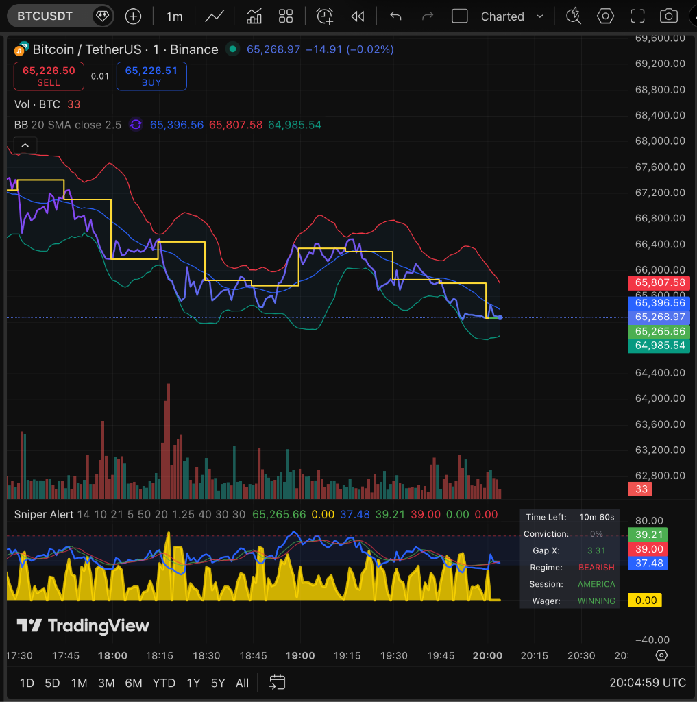
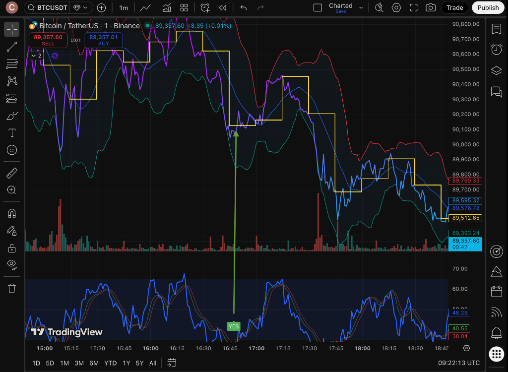

# Sniper HUD - Project Walkthrough
**Repository**: [CS-O-SC/Sniper-HUD](https://github.com/CS-O-SC/Sniper-HUD)

## Overview
The **Sniper HUD** is a specialized Pine Script v6 strategy interface designed for **15-minute Bitcoin Binary Wagers** and short-term scalping. Unlike traditional indicators that issue binary "Buy/Sell" alerts, Sniper HUD calculates a real-time **Conviction Score (0-100%)** based on Bayesian probability, market regime, and session context.

It answers one question: *"Is this mean-reversion trade valid RIGHT NOW?"*

## Visuals

*Main Chart with Strike Line and Indicator Pane*

*Close-up of Signals and Strike Line*

## Key Features

### 1. The Conviction HUD (Top-Right Panel)
A live dashboard providing instant situational awareness:
-   **Conviction**: Real-time weighted probability score (0-100%) based on Bayesian inference.
-   **Regime**: Current trend classification (Bullish/Bearish) via EMA slope analysis.
-   **Session**: Active volume weight based on UTC session (America, Europe, Asia, Weekend).
-   **Gap X**: Precise distance from the 15m anchored Strike Price.
-   **Time Left**: Countdown with integrated "Time Decay" penalty logic.
-   **Wager Status**: Live PnL status (ITM/OTM) relative to the current window's Strike Line.

### 2. Trend Regime Filter ("The Wind")
Prevents "fighting the escalator" by ensuring trade directionality aligns with dominant momentum.
-   **Logic**: Real-time monitoring of the **5-minute EMA (50)** slope and price positioning.
-   **Bullish Regime**: Suppresses SELL signals; authorizes "Dip Buys" only when RSI < 35.
-   **Bearish Regime**: Suppresses BUY signals; authorizes "Rally Sells" only when RSI > 65.
-   **Impact**: Dynamically filters counter-trend signals during high-volatility breakouts, significantly reducing "fake-out" exposure.

### 3. Session-Aware Volume ("The Pulse")
Recognizes that not all volume is equal by adjusting conviction based on global liquidity cycles.
-   **Logic**: Dynamically scales the Bayesian score based on the active UTC trading session and day of the week.
-   **AMERICA (13-21 UTC)**: **1.4x** Weight (High Confidence/Peak Liquidity).
-   **EUROPE (07-13 UTC)**: **1.2x** Weight (Standard/High Participation).
-   **ASIA (23-07 UTC)**: **0.7x** Weight (Noise Filter/Lower Volatility).
-   **WEEKEND**: **0.35x** Weight (Heavy Penalty for low-liquidity environments).

### 4. Smart Time Decay ("The Cliff")
Signals are dynamically penalized based on the elapsed time within the 15-minute wager window to prevent late-cycle exposure.
-   **Logic**: A non-linear multiplier that aggressively devalues the Conviction Score as the candle approaches settlement.
-   **0–9 Mins (Safe Zone)**: **100%–80% Strength**. Optimal entry window for price action to develop.
-   **10–11 Mins (Caution)**: **80%–60% Strength**. Increased risk of "flat" finishes or mean-reversion failure.
-   **12–13 Mins (The Cliff)**: **25% Strength**. Severe penalty for signals occurring too close to the expiry.
-   **14+ Mins (The Floor)**: **10% Strength**. Signals are effectively suppressed to avoid "last-minute" volatility traps.

### 5. The Dynamic Strike Line ("The Target")
Synchronizes price action with the 15-minute settlement cycle to provide a fixed reference for trade execution.
-   **Logic**: Anchors the `open` price at the start of every 15-minute interval (00, 15, 30, 45).
-   **Visual**: A persistent **Step-line** overlay that tracks the current window's entry point.
-   **Real-time PnL**: The line dynamically shifts color—**Lime** (ITM) or **Maroon** (OTM)—to indicate current trade status relative to the strike price.
-   **Historical Context**: Fades historical strike lines to **Yellow** after the window closes, providing a visual "heatmap" of recent settlement zones without cluttering the current view.

### 6. Visual Architecture
- **Dual-Layer Display**:
    - **Main Chart**: Step-line overlays for window tracking and historical strike zones.
    - **HUD Dashboard**: A clean, table-based interface for rapid decision-making without obstructing price action.
- **Dynamic Transparency**: Logic-driven opacity that highlights high-conviction signals while dimming noise.

### 6. Gravity Engine V1 (Spatial Logic)
Introduces "Escape Velocity" to differentiate between valid late-window signals and "traps".
-   **Concept**: If price is too close to the strike (stagnating) at Minute 12, the signal is killed. If it's "Orbiting" or "Moonshotting", the signal is boosted.
-   **Escape Velocity**: Dynamic threshold (e.g., 300 points in NY vs 130 in Asia).
-   **Gap Velocity**: Checks the speed of price expansion (3-bar lookback).
-   **Bite Zone Logic (Min 9-13)**:
    -   *Moonshot*: Gap > 800 -> **1.5x Boost**.
    -   *Ignition*: Gap > EscapeVel -> **1.2x Boost**.
    -   *Trap*: Gap < EscapeVel & Slow -> **0.1x Penalty**.

## Technical Stack
-   **Language**: Pine Script v6
-   **Core Oscillators**: RSI (14), WaveTrend (10, 21)
-   **Logic Engine**: Weighted Sum Model + Gravity Engine (Spatial-Temporal).

## Installation
1.  Open TradingView -> Pine Editor.
2.  Copy and paste the `Sniper-HUD.pine` code.
3.  Click "Save" and "Add to Chart".

## License
© 2026 ChiamakaS. This project is for educational and personal use only. Trading involves significant risk; always validate signals against your own risk management protocols.

## Repo Meta-Tags
`pinescript-v6`, `binary-options`, `bayesian-inference`, `regime-filter`, `market-sessions`, `wavetrend`, `tradingview-indicator`, `scalping-strategy`, `rsi-divergence`, `market-microstructure`, `tradingview`, `rsi`
